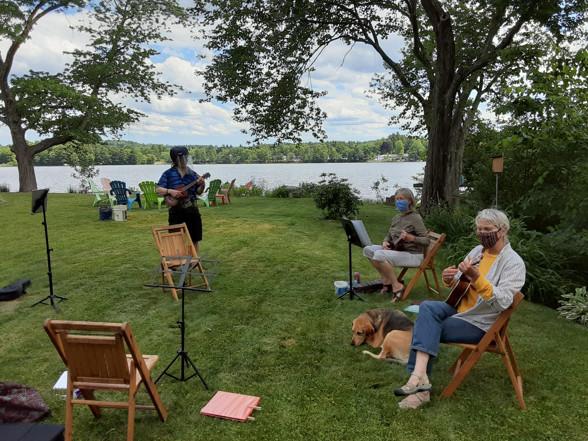

# What: The Summer UUUkes

## Why: Playing is More Fun Together!

Safety rules apply.\*

## When: Sundays, 2 PM
 
## Where: Littleton

Eventually, the Gazebo of Fay Park, but that is closed at the moment. I will
have to ask a minister I know for a favor. This will be discuseed in our
email group

 

## \* Safety rules

**No mask, no play**. 

**No stigma to a face sheild.** Doug modified his winter ski helmut (see photo).

**Bring your chair.**

**Bring your music stand**

**Group limited to first 10**

## Our email group

### summeruuukes@googlegroups.com
 
## [Tutorials](tutorials.md)
 
## [PDFs](pdfs/pdfs.md)

## Goals

My main goal is to have fun again with the people who play the ukulele. My
second goal is to sound better while I play. These tutorials are great, so long
as one actually spends time with them.

The idea is to spend a half hour on the tutorials and another half hour playing
anyone's choice song from The Big Yellow Book. Previous weeks songs are always
allowed.
